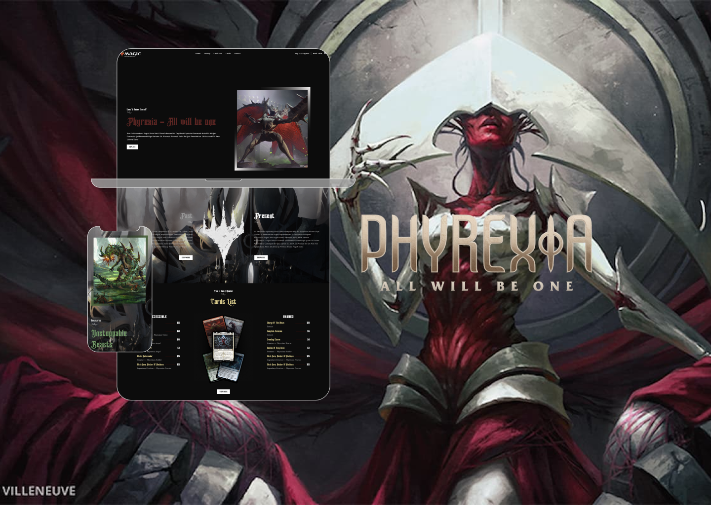

# PHYREXIA - All will be One

## Description
Thanks to JavaScript Mastery on Youtube, I built my first website using the React framework. This is an important project for me because React is one of the most important tools for building intent pages :blue_heart:
###
My site is mainly focused on frontend. This means that there is no greater functionality than just its appearance :heart_eyes:

## Link to tutorial :tv:
### [Build and Deploy a Fully Responsive Restaurant Website with Modern UI and UX in ReactJS](https://www.youtube.com/watch?v=4oV65GVVits&list=LL&index=38&t=4s&ab_channel=JavaScriptMastery)
>[JavaScript Mastery ](https://www.youtube.com/@javascriptmastery)

## Technologies used
- React
- Javascript

# My Portfolio :smiling_imp:
### [Behance](https://www.behance.net/KarolKomorowski) :computer:

### [Github](https://github.com/FLaMeREVENGE) :paw_prints:

